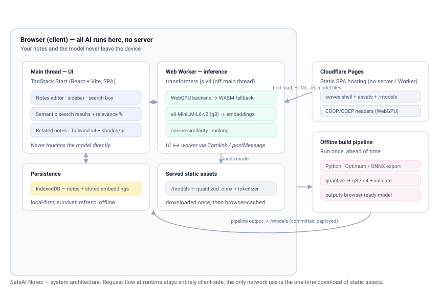

# SafeAI Notes

A private, local-first notes app with **semantic search that runs entirely in your browser**. You write notes; the app finds them by *meaning* (not keywords), and surfaces related notes — all powered by an AI model that runs on your own machine. Your data never leaves the device, and there is no server doing inference, no API key, and nothing to pay per request.

**Live demo:** https://safeai.pages.dev


---

## What it does

- **Semantic search.** Search by concept, not exact words. Searching *"food"* surfaces the pasta and sourdough notes; searching *"japan"* pulls up the Tokyo and Kyoto notes — ranked by relevance, even when the query words never appear in the note.
- **Related notes.** Open any note and see the most semantically similar notes, each with a relevance score.
- **Fully private.** All embedding and ranking happens in-browser. Notes are stored locally in IndexedDB and never sent anywhere.
- **Works offline.** After the model downloads once, search works with no network connection.
- **Demo mode.** First-time visitors can load a set of sample notes to try search immediately.

---

## Architecture



At runtime everything is client-side. The UI never touches the model directly — all inference runs in a **Web Worker** so the interface never freezes during embedding. The only network activity is the one-time download of the static assets (app shell, JS, and the model files), after which the browser caches them.

The model itself is prepared **ahead of time** by an offline Python pipeline (see below) and shipped as static files the browser loads locally.

---

## Tech stack

| Layer | Choice |
|---|---|
| Framework | TanStack Start (React + Vite, TypeScript), built as a static SPA |
| Styling | Tailwind CSS v4 + shadcn/ui |
| In-browser inference | transformers.js v4, running in a Web Worker |
| Embedding model | `all-MiniLM-L6-v2`, quantized to int8 (q8) |
| Vector search | Cosine similarity, computed in the worker |
| Persistence | IndexedDB (via `idb`) |
| Model prep | Python — Hugging Face Optimum / ONNX export + quantization |
| Hosting | Cloudflare Pages (static) |
| Tests / CI | Vitest + GitHub Actions |

---

## The model pipeline

The browser can't run an arbitrary model — it needs an ONNX-format, quantized model small enough to download and run client-side. The `model-pipeline/` directory contains a Python tool that produces exactly that:

1. Exports a base embedding model to ONNX.
2. Produces quantized variants (q8 and q4).
3. **Validates** the quantized model by comparing its embeddings against the original (cosine similarity), so quality loss is measured rather than assumed.
4. Outputs the files in the layout transformers.js expects.

The app loads the output of this pipeline — so the model running in the browser is one I produced and verified, not an off-the-shelf hosted endpoint.

```bash
cd model-pipeline
python3.12 -m venv venv && source venv/bin/activate
pip install -r requirements.txt
python pipeline.py
```

---

## Running locally

```bash
pnpm install
pnpm dev          # http://localhost:5173
```

```bash
pnpm build        # production build → dist/client
pnpm test         # run the test suite
pnpm lint         # lint + format check
```

---

## Engineering decisions

This section documents the choices that shaped the project and the trade-offs behind them.

**In-browser inference instead of a server.** The defining constraint is that the AI runs on the client. This makes the privacy guarantee real (data physically cannot leave the device) and removes any inference cost or backend to operate. The trade-off is that the model must be small and the first load downloads it — which is why model preparation became its own piece of work.

**Building the model rather than calling one.** Rather than depend on a hosted embedding API, I built a pipeline that exports and quantizes the model to an int8 ONNX build the browser can run, and validates that quantization didn't meaningfully degrade quality. This keeps the whole system self-contained and gave me a measured handle on the size-vs-accuracy trade-off.

**WebGPU with a WASM fallback.** Inference tries the WebGPU backend first for speed, and falls back to WASM (CPU) when WebGPU is unavailable. This was a deliberate robustness choice — performance varies a lot across machines, so the app degrades gracefully instead of failing on hardware without good GPU support.

**Inference in a Web Worker.** All model work runs off the main thread, communicating with the UI via a thin message interface. The UI stays responsive even while the model loads or embeds, which matters because embedding is the heaviest operation in the app.

**Cutting on-device text generation.** An earlier version included summarization and auto-tagging using a small in-browser language model. After evaluating the output, I removed both features: a model small enough to run in a browser tab can't generate summaries at an acceptable quality, and shipping a visibly weak feature is worse than not shipping it. Embeddings, by contrast, are a task small models do *well* — so I focused the product on semantic retrieval, where it genuinely shines. Knowing what to cut was part of the design.

**Static SPA deployment.** Because all logic is client-side, the app needs no server-side rendering at runtime. Deploying as a static single-page app (rather than a server/Worker) removed an entire class of hosting constraints and is the honest match for what the app actually is. The model and WASM are served as static assets, with the cross-origin isolation headers (COOP/COEP) that WebGPU requires.

**A performance bug worth noting.** During development, page loads were stalling for minutes. The model wasn't the cause — instrumentation showed it loaded in ~2 seconds. The real issue was the dev server serving a large dependency as hundreds of individual modules, saturating its request handling and blocking everything else (including CSS). Pre-bundling that dependency fixed it. The lesson that stuck: measure where the time actually goes before optimizing.

---

## Possible extensions

- Encrypted cross-device sync (keeping the privacy model intact).
- "Chat with your notes" retrieval-augmented answering, once on-device generation models improve.
- Larger / swappable embedding models via the same pipeline.

---

## License

MIT
